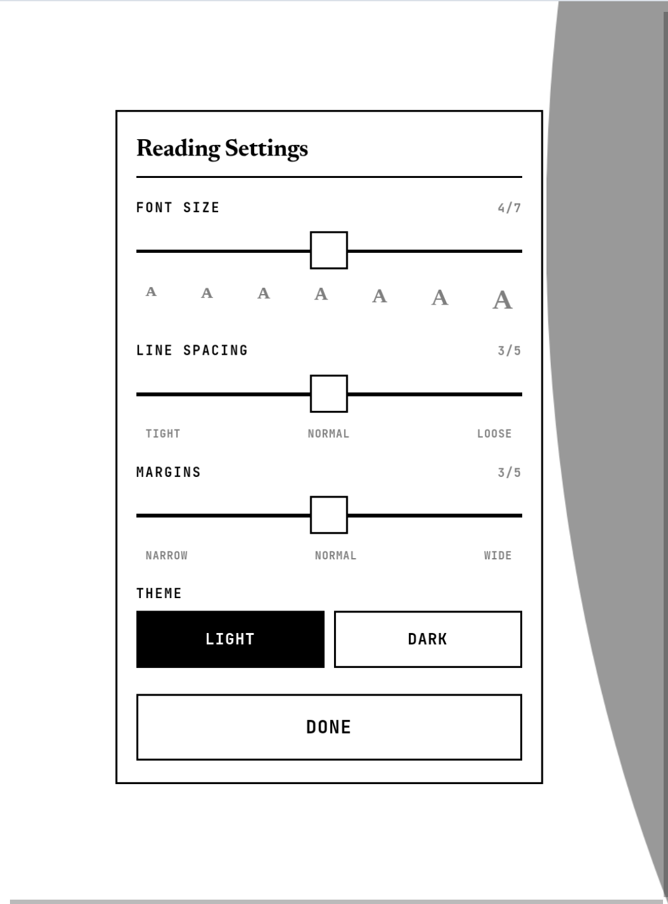

# kavita-epaper

A lightweight web UI for [Kavita](https://www.kavitareader.com/), tuned for e-ink readers and tablets. Reads EPUB only.

Kavita's built-in web reader works fine on desktops but is heavy on low-powered devices. Animated transitions, dark chrome surfaces, settings panels designed for mouse and keyboard. On e-ink readers like the OBOOK6 you get laggy navigation and bright UI elements that ghost across page turns. On tablets it works but is overkill if you just want to read.

kavita-epaper is a small FastAPI proxy that sits in front of your existing Kavita server. It uses Kavita's API for library, metadata, progress, and EPUB content. Only the front-end is replaced. Your Kavita install is still the source of truth, nothing is duplicated.

**EPUB only.** The built-in reader does not handle comics (CBZ, CBR, etc.) or PDFs. See [What this isn't](#what-this-isnt) below.

**A note on origins.** I'm not a programmer. Claude (Anthropic's AI) did the actual coding. I drove design decisions, on-device testing on a real OBOOK6, and the calls about what to ship. If you spot something questionable in the implementation, open an issue or PR. Honest criticism welcome.

## Tested on

Devices I've actually tested:

- **OBOOK6** (6" e-ink, ~375×500 CSS px portrait, Android-based). Primary target.
- **Samsung Galaxy Tab S10 FE.** Used as a PWA. Dark mode helps for night reading.
- **iPad (6th gen).** Used as a PWA via Safari.
- **Desktop browsers** (Chrome, Firefox, Safari). For admin and incidental reading. UI is tuned for small screens but doesn't break at desktop sizes.

If you try it on something else, open an issue with the device name and any quirks.

## Screenshots

<!-- TODO: capture screenshots and replace these placeholders.
     Recommended set:
       1. Library grid (light mode) on a phone or tablet
       2. Reader view with text (light mode)
       3. Settings panel open in the reader
       4. Reader view (dark mode)
       5. (Optional) Photo of the UI rendered on an actual e-reader (OBOOK6 or similar)
     Host them under docs/screenshots/ in the repo and reference like below. -->

| Library | Reader | Settings | Dark mode |
|---------|--------|----------|-----------|
|  |  |  |  |

## Features

- **Single sign-in.** Kavita username and password are sent once. The JWT is held in a signed HTTP-only cookie on the server. Browser never touches the token.
- **Library-first UI.** No dashboard, no homescreen. Open the PWA and you're in your books. Snap-scroll library tabs, cover grid, big tap targets.
- **Built-in EPUB reader.** Proxies Kavita's `book-page` API and wraps it in an e-ink-friendly shell. CSS multi-column pagination via native `scrollLeft`. Same approach as Kavita's web reader so no edge bleed.
- **Progress syncs with Kavita.** Tap a book, resume where you left off. Tracked per-user via Kavita's `/api/Reader/get-progress` and `/api/Reader/progress` endpoints. Open the same book in Kavita's web UI on another device and your position is there too.
- **Dark mode.** Per-device toggle in reader settings (⚙). Light by default. Single CSS variable swap so the whole UI flips consistently.
- **EPUB downloads.** ↓ button on any chapter streams the EPUB through the proxy. Useful for sideloading to NeoReader, Calibre, KOReader, etc.
- **Grayscale covers.** Pre-rendered with Pillow before serving. Cuts file size and renders cleanly on e-ink.

## Requirements

- A reachable Kavita instance (1.0+, needs `book-page` and `get-progress` endpoints).
- Debian or Ubuntu LXC/VM with `python3`, `python3-venv`, `systemd`, `rsync`.
- A reverse proxy with TLS (NPM, Caddy, Traefik, etc.) if you're exposing it past a trusted LAN.
- Optional: PWA-capable browser (Chrome, Edge, Safari) for install-to-homescreen.

> Upgrading from a previous release? See [`CHANGELOG.md`](./CHANGELOG.md) for version-specific notes.

## Install

Pick whichever fits how you got the code.

### Option A: latest release from GitHub (recommended)

```bash
# Resolve the latest release tarball URL via the GitHub API, download, extract, install
LATEST=$(curl -fsSL https://api.github.com/repos/coryjarboe/kavita-epaper/releases/latest \
  | grep -oE '"browser_download_url"[[:space:]]*:[[:space:]]*"[^"]*kavita-epaper-v[0-9][^"]*\.tar\.gz"' \
  | head -1 | grep -oE 'https://[^"]+')
mkdir -p /tmp/kavita-epaper
curl -fsSL "$LATEST" | tar -xzf - -C /tmp/kavita-epaper
cd /tmp/kavita-epaper
sudo ./deploy/install.sh
```

Pulls the latest tagged release. What most people want.

### Option B: clone the repo (gets latest `main`, may be ahead of releases)

Needs `git`.

```bash
git clone https://github.com/coryjarboe/kavita-epaper.git
cd kavita-epaper
sudo ./deploy/install.sh
```

Use this for the absolute latest, or if you plan to modify the code locally.

### Option C: from a tarball you already have

```bash
mkdir -p /tmp/kavita-epaper
tar -xzf kavita-epaper-vX.Y.Z.tar.gz -C /tmp/kavita-epaper
cd /tmp/kavita-epaper
sudo ./deploy/install.sh
```

For offline installs, air-gapped environments, or pinning a specific version.

This creates:

- `/opt/kavita-epaper/` (code and venv)
- `/opt/kavita-epaper/.env` (config, auto-generated session secret, edit to point at your Kavita)
- `/var/cache/kavita-epaper/covers/` (grayscale cover cache)
- `/var/lib/kavita-epaper/releases/` (drop release tarballs here for no-args `update.sh`)
- `kavita-epaper` system user
- `kavita-epaper.service`

The defaults assume Kavita is on the same host. If Kavita is on a different machine, edit `KAVITA_BASE_URL` in `/opt/kavita-epaper/.env` to point at it (e.g. `http://10.0.0.50:5000`). Then:

```bash
sudo systemctl restart kavita-epaper
```

Check it's running:

```bash
systemctl status kavita-epaper
journalctl -u kavita-epaper -f
```

## Reverse proxy

Default bind is `0.0.0.0:8095` so the reverse proxy can live on a different host. Point a proxy host at `http://<kavita-epaper-host-ip>:8095`.

### NPM example

| Field                 | Value                              |
|-----------------------|------------------------------------|
| Domain                | `read.example.com` (or whatever)   |
| Scheme                | `http`                             |
| Forward host          | `<kavita-epaper host IP>`          |
| Forward port          | `8095`                             |
| Block common exploits | on                                 |
| Websockets            | off (not used)                     |
| SSL                   | whatever cert your proxy uses      |
| Force SSL             | on                                 |

Caddy and Traefik work the same way. Single HTTP upstream, no special headers needed past `X-Forwarded-Proto` (uvicorn runs with `--proxy-headers --forwarded-allow-ips '*'`).

### If your reverse proxy is on the same host

Set `KAVITA_EPAPER_HOST=127.0.0.1` in `/opt/kavita-epaper/.env` and restart. Limits exposure to localhost so the proxy is the only way in.

### Direct access without a reverse proxy

For a quick try, it works directly on its bound IP and port. Open `http://<host-ip>:8095` in a browser. The session cookie is issued without the `Secure` flag when accessed over plain HTTP (`KAVITA_EPAPER_COOKIE_SECURE=auto` does this by default), so login persists.

> **Security note.** kavita-epaper uses Kavita's own auth model. Your credentials are posted to Kavita on first sign-in over whatever transport you've configured. If you're comfortable accessing Kavita over plain HTTP on a trusted LAN, kavita-epaper sits at the same level. For anything internet-facing, put TLS in front of both.

## Update

Four ways:

```bash
# 1. Explicit tarball path
sudo /opt/kavita-epaper/update.sh /path/to/kavita-epaper-vX.Y.Z.tar.gz

# 2. URL (auto-downloads)
sudo /opt/kavita-epaper/update.sh https://my.server/kavita-epaper-vX.Y.Z.tar.gz

# 3. Auto-pick newest from a local release directory
sudo /opt/kavita-epaper/update.sh

# 4. Latest release from a GitHub repo
sudo /opt/kavita-epaper/update.sh --github coryjarboe/kavita-epaper
```

Mode 3 picks the highest-versioned `kavita-epaper-*.tar.gz` in `$KAVITA_EPAPER_RELEASES_DIR`. Defaults to `/var/lib/kavita-epaper/releases`. Adjust in `.env` if you drop tarballs somewhere else.

Mode 4 hits GitHub's `/releases/latest` API for the given `owner/repo`, finds the `kavita-epaper-v*.tar.gz` asset, and downloads it. Anonymous API access is rate-limited to 60 requests per hour per IP. For private repos or higher limits, export `GITHUB_TOKEN` and use `sudo -E`:

```bash
export GITHUB_TOKEN=ghp_...
sudo -E /opt/kavita-epaper/update.sh --github your-org/kavita-epaper
```

All four modes preserve `.env` and the cover cache, skip `pip install` when `requirements.txt` is unchanged, and verify the service comes back up before exiting non-zero.

## Config

`/opt/kavita-epaper/.env`. The ones you'll actually touch:

| Variable                     | Default                         | Notes                                                |
|------------------------------|---------------------------------|------------------------------------------------------|
| `KAVITA_BASE_URL`            | `http://127.0.0.1:5000`         | Kavita API address (server-to-server). Change if Kavita isn't local. |
| `KAVITA_EPAPER_HOST`         | `0.0.0.0`                       | Interface to bind. `127.0.0.1` is loopback only.     |
| `KAVITA_EPAPER_PORT`         | `8095`                          | TCP port to listen on.                               |
| `KAVITA_EPAPER_SECRET`       | auto-generated                  | Signs session cookies. Don't change after install.   |
| `KAVITA_EPAPER_COOKIE_SECURE`| `auto`                          | `auto` follows request scheme. Or pin `true`/`false`.|
| `KAVITA_EPAPER_SESSION_TTL`  | `2592000` (30d)                 | Session lifetime in seconds.                         |
| `KAVITA_EPAPER_GRAYSCALE`    | `true`                          | Pre-render covers to grayscale. Disable for color.   |
| `KAVITA_EPAPER_RELEASES_DIR` | `/var/lib/kavita-epaper/releases` | Where `update.sh` looks when called with no args.  |

Restart after changes:

```bash
sudo systemctl restart kavita-epaper
```

## Uninstall

```bash
sudo systemctl disable --now kavita-epaper
sudo rm -rf /opt/kavita-epaper /var/cache/kavita-epaper /var/lib/kavita-epaper /etc/systemd/system/kavita-epaper.service
sudo userdel kavita-epaper
sudo systemctl daemon-reload
```

## What this isn't

- **Not a Kavita replacement.** A thin proxy and UI in front of Kavita. Kavita does the actual work (library scan, metadata, progress storage, EPUB parsing).
- **EPUB only.** The built-in reader handles EPUB. No support for comics (CBZ, CBR, CB7, CBT, ZIP, RAR, 7Z), PDF, or raw image folders. Library browse still works for those formats and the download button still streams the file, but the reader button is hidden for non-EPUB items. Read those in Kavita's own web reader, or download and open them in a dedicated app.
- **Not multi-user-aware in any special way.** Each browser session authenticates against Kavita and gets its own cookie. No user management here, it's all Kavita's user system.
- **No background sync, no offline reading.** Online only. The service worker is intentionally a network pass-through (no caching) so library changes show up immediately.

## File layout

```
/opt/kavita-epaper/
├── app/                  # FastAPI app
│   ├── main.py
│   ├── static/           # CSS, JS, icons, manifest
│   └── templates/        # Jinja2 (base, library, series, read, login)
├── venv/                 # Python virtualenv
├── requirements.txt
├── VERSION
├── .env                  # config (chmod 600)
└── update.sh             # dropped in by install.sh
```

Listens on `0.0.0.0:8095` by default. Set `KAVITA_EPAPER_HOST=127.0.0.1` in `.env` for loopback-only when the reverse proxy is on the same host. Always front it with a TLS-terminating reverse proxy in production.

## License

MIT. See [`LICENSE`](./LICENSE).
